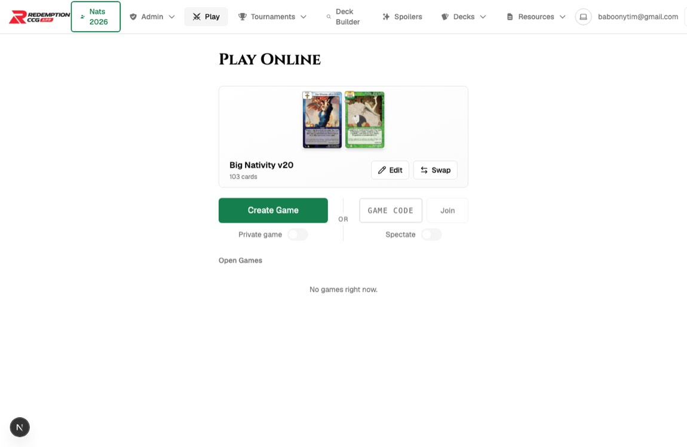
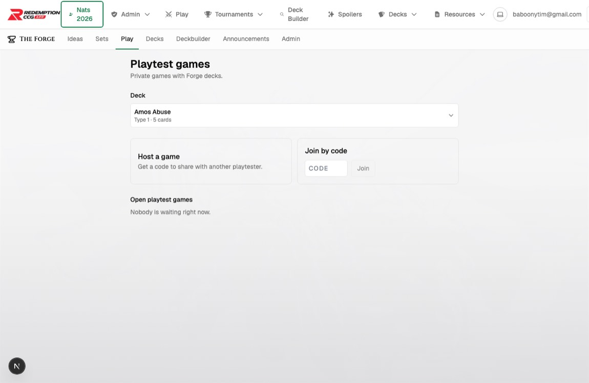
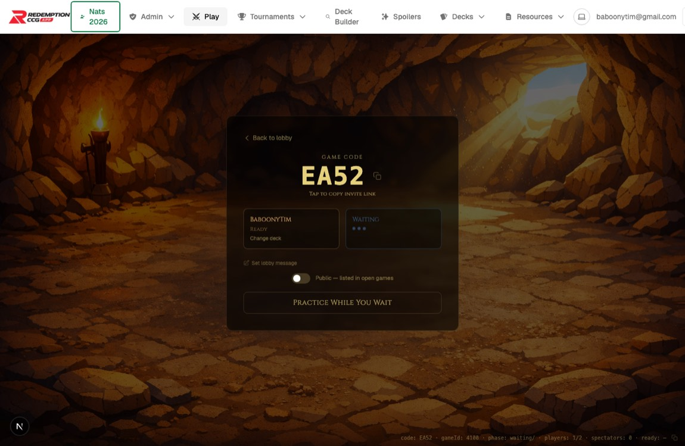
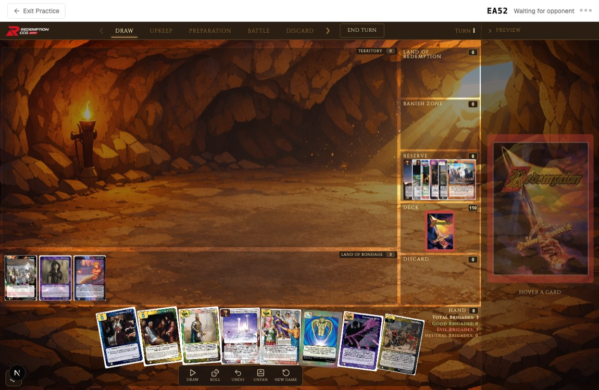
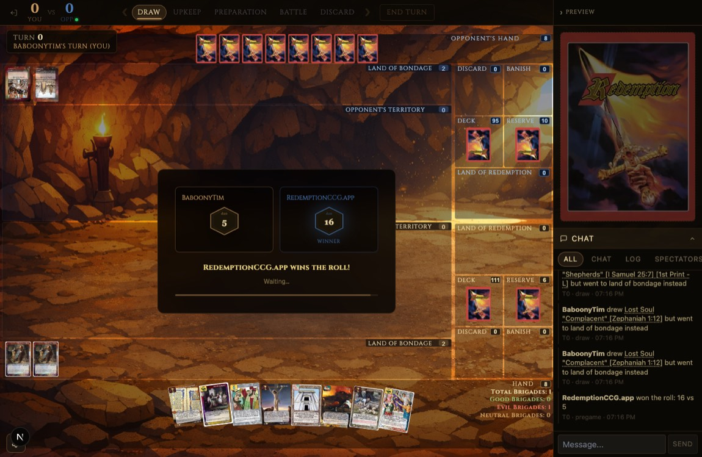
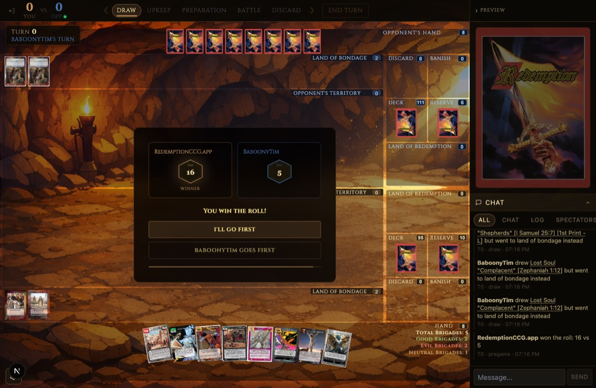
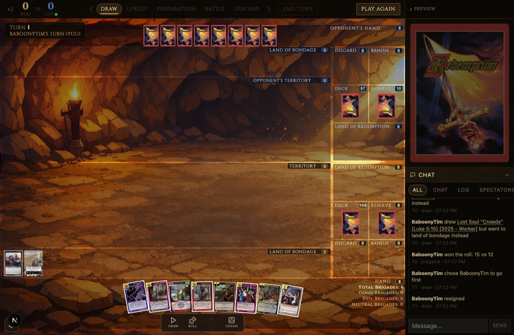
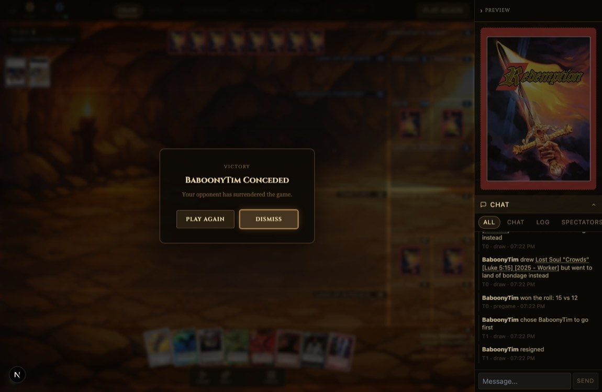
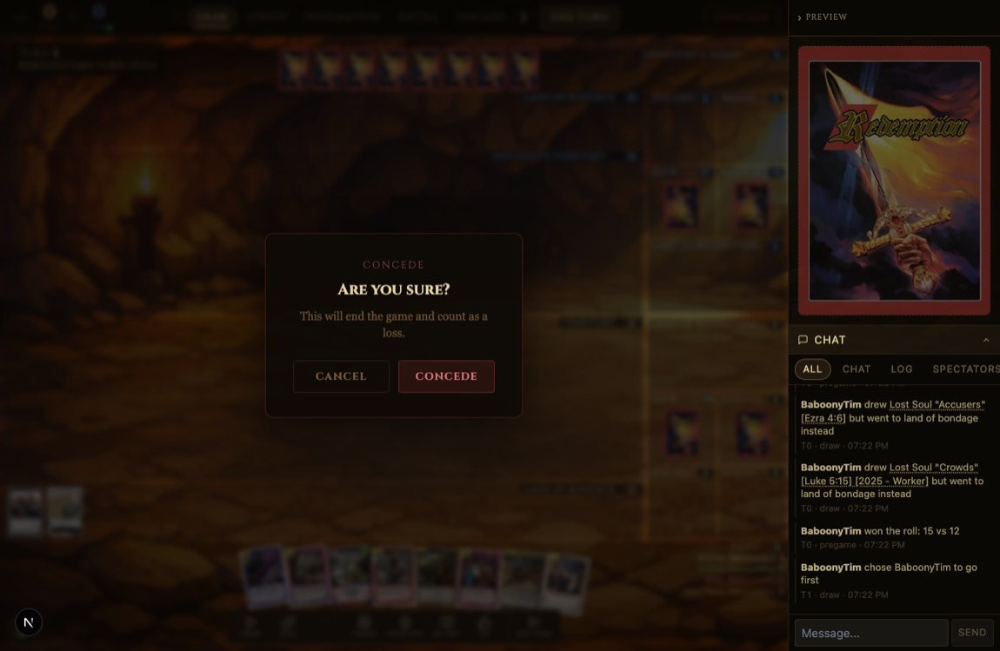
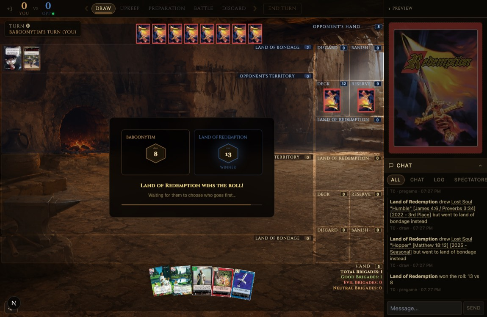

# Multiplayer Flows — UX Audit

**Scope:** the six common online-play flows, for **both** normal games (`/play`) and Forge playtest games (`/forge/play`):

1. Choose deck
2. Create game
3. Wait (waiting room)
4. Join game
5. Pre-game ritual (roll-off → choose first → reveal)
6. Post-game concede / rematch

**Lens:** user experience first. What's working, what's friction, what's broken, what's inconsistent.

---

## How this was verified

This audit was done in two passes:

1. **Source read** of the whole `/play` + `/forge/play` surface and the SpacetimeDB module.
2. **Live verification** — a real 2-player game driven end-to-end in Playwright with two authenticated accounts (`baboonytim` as host, `landofredemption` as joiner), for **both** a normal game and a Forge game: choose → create → wait → join → ritual → play → concede → game-over → rematch. Screenshots of each state are embedded below and live in [`./multiplayer-flows-ux-audit-assets/`](./multiplayer-flows-ux-audit-assets/).

The live pass **changed several conclusions** — corrections are called out with **`LIVE:`** verdicts. The most important: my top code-derived 🔴 ("practice mode strands both players") turned out to be **false**, and a different, real issue took its place (see §3 and §5).

### Severity legend

| Tag | Meaning |
|-----|---------|
| 🔴 **High** | Blocks, confuses, or strands a real user. Fix first. |
| 🟠 **Medium** | Friction or inconsistency that erodes polish and trust. |
| 🟡 **Low** | Polish / cosmetic / edge-case. |
| ✅ **Working** | Deliberately good — don't regress it. |

---

## Headline corrections from the live pass

- **Falsified 🔴 → 🟠:** Practicing-while-waiting does **not** strand the host. When the opponent joins, the host is auto-pulled out of practice into the ceremony. The *real* problem is that it's an **abrupt, un-announced, agency-free jump** into an already-resolved dice roll. (§3/§5)
- **New, material 🟠:** The **entire "Ready up" / deck-select phase is unreachable dead code.** `join_game` rolls immediately (`pregamePhase: 'rolling'`); `'deck_select'` is never assigned anywhere in the module. The image-preload-before-ready protection I originally praised guards a button that never renders. (§5)
- **Confirmed at source 🔴:** There is **no game-rule win detection at all.** Every `status:'finished'` write is resign / disconnect-timeout / lobby-cleanup. A rules win (rescue 5 souls) is never detected or celebrated. (§6)
- **New, sharp 🟠:** After a concede, the **resigner is left on a fully playable-looking board** with no persistent "game over" state — the only signal is a tiny "Play Again" and a chat line. The *loser* is the one left confused; the winner gets a clean modal. (§6)

---

## Where each flow lives (map)

| Flow | Normal (`/play`) | Forge (`/forge/play`) |
|------|------------------|------------------------|
| Choose deck | [GameLobby.tsx](app/play/components/GameLobby.tsx) + [DeckPickerModal.tsx](app/play/components/DeckPickerModal.tsx) | [ForgeGameLobby.tsx](app/forge/play/games/ForgeGameLobby.tsx) + [ForgeDeckPicker.tsx](app/forge/play/games/ForgeDeckPicker.tsx) |
| Create game | `handleCreateGame` ([GameLobby.tsx:184](app/play/components/GameLobby.tsx#L184)) → [client.tsx:772](app/play/[code]/client.tsx#L772) | `handleCreate` ([ForgeGameLobby.tsx:53](app/forge/play/games/ForgeGameLobby.tsx#L53)) → [client.tsx:717](app/play/[code]/client.tsx#L717) |
| Wait | [PregameScreen.tsx](app/play/components/PregameScreen.tsx) (`lifecycle==='waiting'`) + [WaitingRoomGoldfish.tsx](app/play/components/WaitingRoomGoldfish.tsx) | same |
| Join game | `handleJoinGame` / `handleJoinFromLobby` ([GameLobby.tsx:154](app/play/components/GameLobby.tsx#L154)) + [LobbyList.tsx](app/play/components/LobbyList.tsx) | `handleJoin` ([ForgeGameLobby.tsx:59](app/forge/play/games/ForgeGameLobby.tsx#L59)) |
| Pre-game ritual | `PregameCeremonyOverlay` + `RollAndChooseArea` + `RevealArea` ([PregameScreen.tsx:702](app/play/components/PregameScreen.tsx#L702)) | same |
| Concede / rematch | [TurnIndicator.tsx](app/play/components/TurnIndicator.tsx) + [GameOverOverlay.tsx](app/play/components/GameOverOverlay.tsx) | same (Forge auto-reuses deck) |

The whole lifecycle is one state machine in [client.tsx](app/play/[code]/client.tsx) — `'creating' | 'joining' | 'waiting' | 'pregame' | 'playing' | 'finished' | 'error'`. Normal and Forge share it; they diverge only at the lobby and a few `isForge` branches.

---

## 1. Choose deck

**Normal:** rich card-art preview, prominent green **Create Game** CTA, **Swap**/**Edit**, format toggles.
**Forge:** text-only deck dropdown, muted bordered "Host a game" card, no art, no CTA styling.

| Normal lobby | Forge lobby |
|---|---|
|  |  |

### Findings

- 🟠 **Two divergent lobby UIs for the same job.** **`LIVE: confirmed`** — the screenshots above are the same task rendered two completely different ways: the normal lobby is polished and CTA-forward; the Forge lobby is a spartan form with a text dropdown and a "Host a game" card that doesn't even read as a button. A player who uses both re-learns the screen each time. — [GameLobby.tsx](app/play/components/GameLobby.tsx) vs [ForgeGameLobby.tsx](app/forge/play/games/ForgeGameLobby.tsx)
- 🟠 **Deck-change verb differs on every surface:** "Swap" (lobby), "Change deck" (pregame), "Choose a deck…" (Forge). — [GameLobby.tsx:337](app/play/components/GameLobby.tsx#L337), [PregameScreen.tsx:401](app/play/components/PregameScreen.tsx#L401), [ForgeDeckPicker.tsx:63](app/forge/play/games/ForgeDeckPicker.tsx#L63)
- 🟠 **Forge empty state is a dead end** ("No Forge decks yet — build one first.") with no link, while the normal lobby links to the builder. — [ForgeGameLobby.tsx:83](app/forge/play/games/ForgeGameLobby.tsx#L83)
- 🟡 **Pre-selected deck isn't explained** (silently your last-played deck). — [GameLobby.tsx:37](app/play/components/GameLobby.tsx#L37)
- 🟡 **Forge lobby has no card preview** while the normal lobby leads with art.

### Working well
- ✅ **Deck images pre-warm on selection** — card art is cached before you even click Create/Join. **`LIVE: confirmed`** (the board loaded instantly). — [GameLobby.tsx:47-78](app/play/components/GameLobby.tsx#L47-L78)
- ✅ Forge picker filters client-side across yours + shared, scaling to hundreds of decks. — [ForgeDeckPicker.tsx:182](app/forge/play/games/ForgeDeckPicker.tsx#L182)

---

## 2. Create game

Neither lobby creates the game where you click — they generate a random 4-char code, stash params in `sessionStorage`, and `router.push('/play/[code]')`; the reducer fires *after* navigation once the deck loads. — [GameLobby.tsx:197-212](app/play/components/GameLobby.tsx#L197-L212), [client.tsx:772-789](app/play/[code]/client.tsx#L772-L789)

### Findings

- 🟠 **The sessionStorage handoff is fragile.** If storage is cleared/blocked or the tab is duplicated, the game page shows *"No game parameters found. Please return to the lobby."* — a dead-end after an apparently successful "Create." — [client.tsx:660-666](app/play/[code]/client.tsx#L660-L666)
- 🟠 **Forge "Host a game" has no click feedback** (plain card, instant navigate) while the normal button flips to "Loading deck…" and disables. — [ForgeGameLobby.tsx:94-97](app/forge/play/games/ForgeGameLobby.tsx#L94-L97) vs [GameLobby.tsx:461-468](app/play/components/GameLobby.tsx#L461-L468)
- 🟡 **Client-generated code has no pre-navigation uniqueness check**; a collision surfaces as the generic Connection Error screen. — [GameLobby.tsx:197](app/play/components/GameLobby.tsx#L197)

### Working well
- ✅ **Duplicate-game guard** reuses a finished game instead of spawning a duplicate on a replayed `create` instruction. — [gameEntryDecision.ts](app/play/lib/gameEntryDecision.ts)

---

## 3. Wait (waiting room)

Only the **host** sees a waiting room; the **joiner** is held on the loading screen because `join_game` atomically flips `waiting → pregame`.

### Findings

- 🟠 **Abrupt, agency-free exit from practice** *(revised from my original 🔴)*. **`LIVE: falsified-then-revised`** — I predicted the host would be stranded in practice while the opponent waited. Not true: the instant the joiner joins, the game auto-advances and the host is pulled straight out of practice into the ceremony. **But** the transition is jarring — the host is goldfishing one second and staring at an *already-resolved* dice roll the next ("RedemptionCCG.app wins the roll! Waiting…"), with no "opponent joined" heads-up and no roll of their own. If they lost the roll they may not even register that a real game started. — [client.tsx:1196-1349](app/play/[code]/client.tsx#L1196-L1349)

  | Host, mid-practice | Host, ~6s after opponent joins (no warning) |
  |---|---|
  |  |  |

- 🟡 **Misleading static "Ready" caption.** **`LIVE: confirmed`** — the host's own player card shows a "Ready" label while merely waiting (see the waiting-room shot). The player hasn't readied anything — there's no ready action here at all (see §5). It reads as a status that isn't real. — [PregameScreen.tsx:394-396](app/play/components/PregameScreen.tsx#L394-L396)
- 🟡 **"Change deck" is a 10px low-contrast text link**, easy to miss. — [PregameScreen.tsx:399](app/play/components/PregameScreen.tsx#L399)
- 🟠 **Joiner has no "connected — waiting for host" state** — only the generic cave "Loading…" spinner with a 12s silent failure timeout. — [client.tsx:1133-1160](app/play/[code]/client.tsx#L1133-L1160)

### Working well
- ✅ **Practice While You Wait** is a genuinely nice use of idle time — and it does *not* break the join (see above). — [WaitingRoomGoldfish.tsx](app/play/components/WaitingRoomGoldfish.tsx)
- ✅ **Abandoned/zombie games are hidden from the lobby** via a live-player predicate. — [LobbyList.tsx:36-38](app/play/components/LobbyList.tsx#L36-L38)

---

## 4. Join game

Three entry points: join-by-code, join from the open-games list, invite link (`?join=CODE`).

### Findings

- 🟠 **Invite screen never shows the game's format, so the joiner can pick a mismatched deck and get bounced.** **`LIVE: confirmed`** — in testing, the joiner's preselected deck was a **Paragon** deck against a **Type 1** game; the invite screen ("You've been invited to game EA52") shows no format, so clicking "Join as Player" would navigate → load deck → mismatch → redirect back with an error. A heavyweight round-trip to learn "wrong format." — [client.tsx:793-810](app/play/[code]/client.tsx#L793-L810), [client.tsx:1032-1041](app/play/[code]/client.tsx#L1032-L1041)
- 🟡 **Spectate toggle is easy to leave on** — "Join" silently becomes "Watch." — [GameLobby.tsx:536-555](app/play/components/GameLobby.tsx#L536-L555)
- 🟡 **Self-join is a full error screen**, not a redirect into your own waiting room. — [client.tsx:1103-1106](app/play/[code]/client.tsx#L1103-L1106)

### Working well
- ✅ **Robust code input** (uppercases, caps at 4, strips junk on paste). — [GameLobby.tsx:502-517](app/play/components/GameLobby.tsx#L502-L517)
- ✅ **Format preflight** gives a crisp "This game is X, your deck is Y" instead of a raw `SenderError`. — [client.tsx:799-809](app/play/[code]/client.tsx#L799-L809)
- ✅ **Invite links classify Forge vs normal** so a Forge invite doesn't show a dead normal-deck picker. — [GameLobby.tsx:92-99](app/play/components/GameLobby.tsx#L92-L99)

---

## 5. Pre-game ritual

**`LIVE: my original model was wrong.`** The real sequence on any join or rematch is: `waiting → (join) → 'rolling'` **immediately** — the server auto-rolls both dice in `join_game` and jumps straight to the roll ceremony. The roll winner then chooses who goes first; a brief reveal auto-acks into `playing`.

### Findings

- 🟠 **The entire "Ready up" / `deck_select` phase is unreachable dead code.** **`LIVE + source: confirmed`** — `join_game` sets `pregamePhase: 'rolling'` ([index.ts:851](spacetimedb/src/index.ts#L851)); `'deck_select'` is **never assigned** anywhere in the module (grep confirms — only compared against). So `pregame_ready` always throws "Not in deck select phase," and the "Ready up" button in `PregameScreen` (with its `isDeckSelect = phase === 'deck_select'` guard) never renders. Two consequences:
  1. A whole ready-up UI + its image-preload gating is latent and misleading (this is where the fake "Ready" caption in §3 comes from).
  2. **The image-preload-before-commit protection is effectively absent** in the real flow — the joiner is dropped straight into the ceremony/board; only the board-level `imagesGateOpen` gate protects them, not the (unreachable) ready gate. — [PregameScreen.tsx:428-456](app/play/components/PregameScreen.tsx#L428-L456), [index.ts:956-985](spacetimedb/src/index.ts#L956)
- 🟠 **The ceremony is long and replays every rematch** (~600ms delay + 1200ms tumble + 2200ms display before the loser auto-acks; winner's choose buttons appear after tumble + 700ms). Fun once; a tax on a best-of-3. — [PregameScreen.tsx:19-23](app/play/components/PregameScreen.tsx#L19-L23)
- 🟡 **Duplicated "Change deck" buttons** in the same card (waiting block + deck_select block). — [PregameScreen.tsx:396-402](app/play/components/PregameScreen.tsx#L396-L402) and [431-438](app/play/components/PregameScreen.tsx#L431-L438)

### Working well
- ✅ **Countdown is server-anchored** — a refresh mid-choose doesn't reset the timer or grant extra time. — [PregameScreen.tsx:872-874](app/play/components/PregameScreen.tsx#L872-L874)
- ✅ **Sensible auto-defaults** (loser auto-acks, AFK winner defaults to first). — [PregameScreen.tsx:893-918](app/play/components/PregameScreen.tsx#L893-L918)
- ✅ **Opponent-disconnect banner** warns before the game is cancelled. — [PregameScreen.tsx:29-49](app/play/components/PregameScreen.tsx#L29-L49)
- ~~✅ Ready-up gated on images preloaded~~ — **removed:** this guards an unreachable button (see above).

---

## 6. Post-game concede / rematch

### Findings

- 🔴 **No game-rule win is ever detected or celebrated.** **`LIVE + source: confirmed`** — every `status:'finished'` write in the module is a **resign** ([index.ts:1873](spacetimedb/src/index.ts#L1873)), a **disconnect-timeout** ([index.ts:1953](spacetimedb/src/index.ts#L1953)), or **lobby cleanup** ([index.ts:759](spacetimedb/src/index.ts#L759), [1769](spacetimedb/src/index.ts#L1769)). The only "winner" the module computes is the **pregame dice roll**. A real Redemption win (rescue the 5th lost soul, deck-out) is never detected, so there is no "You won / You lost" payoff for an actual game. **This is a product gap, not a copy gap.** — [GameOverOverlay.tsx:34-54](app/play/components/GameOverOverlay.tsx#L34-L54)

- 🟠 **After conceding, the resigner is left on a fully playable-looking board.** **`LIVE: confirmed — sharper than the code suggested`** — the "YOU RESIGNED" toast auto-dismisses after 4s, leaving the resigner on a board that still shows live phase tabs (DRAW/UPKEEP/…), an **END TURN** button, a working Draw/Roll/Unfan toolbar, and a draggable hand. The *only* "game over" cues are a small "Play Again" where "Concede" used to be, and a chat line. Meanwhile the **opponent** gets a clean blocking "VICTORY / X Conceded" modal. So the asymmetry lands backwards: the winner gets clarity, the **loser is left looking at a game that appears to still be going.** — [GameOverOverlay.tsx:92-97](app/play/components/GameOverOverlay.tsx#L92-L97), [client.tsx:1575-1608](app/play/[code]/client.tsx#L1575-L1608)

  | Resigner, after the 4s toast lapses (looks playable) | Opponent (clean blocking modal) |
  |---|---|
  |  |  |

- 🟠 **Rematch forces normal players to re-pick a deck every time.** **`LIVE: confirmed`** — Forge auto-reuses the authorized deck (no picker); normal reopens the full deck picker on both request and accept, even to run it back with the same deck. — [GameOverOverlay.tsx:127-160](app/play/components/GameOverOverlay.tsx#L127-L160)
- 🟠 **A pending rematch request can't be cancelled** — "Play Again" becomes a disabled "Waiting…" with no retract; only Back to Lobby (abandon). — [TurnIndicator.tsx:749-781](app/play/components/TurnIndicator.tsx#L749-L781)
- 🟡 **A brief opponent disconnect can momentarily hide "Play Again"** (keys on `isConnected === false`). — [client.tsx:1539-1540](app/play/[code]/client.tsx#L1539-L1540)

### Working well
- ✅ **Concede has a real confirmation** ("Are you sure? This will end the game and count as a loss"). **`LIVE: confirmed`** — clean, clear, dims the board. — [TurnIndicator.tsx:906](app/play/components/TurnIndicator.tsx#L906)

  
- ✅ **Winner's "VICTORY / Conceded" modal** is genuinely nice (see above) — the model to extend to real wins.
- ✅ **Rematch resets in place** via subscription — no navigation. — [GameOverOverlay.tsx:118-120](app/play/components/GameOverOverlay.tsx#L118-L120)
- ✅ **Forge rematch auto-reuses the deck** (no picker). **`LIVE: confirmed`** (the deck picker did not open on Forge Play Again). — [GameOverOverlay.tsx:127-139](app/play/components/GameOverOverlay.tsx#L127-L139)

---

## Forge specifics

The Forge game runs on the same client state machine; it diverges only at the lobby (§1) and in theming/deck-reuse.

- ✅ **Distinct forge (blacksmith) theming** carries through the loading screen and the game board (vs the normal cave). **`LIVE: confirmed`.**

  

- The lobby divergence (§1) and "Host a game" no-CTA (§2) are the main Forge-specific UX gaps.

---

## Cross-cutting themes

- 🟠 **A bespoke "amber parchment" dialog system lives outside the design system.** The pregame/game-over/confirm surfaces are hand-rolled `
`s with hard-coded hex (`rgba(196,149,90)`, `#e8d5a3`), Georgia serif, and inline styles — not shadcn `Dialog`, not Tailwind tokens. A second UI vocabulary to maintain that drifts from the rest of the app. — [GameOverOverlay.tsx](app/play/components/GameOverOverlay.tsx), [PregameScreen.tsx](app/play/components/PregameScreen.tsx), the confirm modals in [client.tsx](app/play/[code]/client.tsx)
- 🟠 **Two parallel lobby implementations** (`GameLobby` vs `ForgeGameLobby`) guarantee the choose/create/join experience keeps diverging.
- 🟡 **Debug artifacts ship to production.** **`LIVE + source: confirmed`** — `DebugOverlay` has **no environment gating** ([DebugOverlay.tsx](app/play/components/DebugOverlay.tsx)) and renders a faint `code: … · gameId: … · phase: …` string on every waiting/loading/pregame screen (visible in the waiting-room shot above). The `console.log('[game-debug] …')` calls in the lifecycle effects are likewise always-on. — [client.tsx:657](app/play/[code]/client.tsx#L657), [PregameScreen.tsx:226](app/play/components/PregameScreen.tsx#L226)
- 🟡 **Inconsistent dismissal on hand-rolled confirms** — some support Escape/backdrop-close (battle end-turn), others don't (deck-reload). — [client.tsx:1659](app/play/[code]/client.tsx#L1659) vs [client.tsx:1975](app/play/[code]/client.tsx#L1975)

---

## Priority shortlist (post-verification)

1. 🔴 **Real win detection + a proper victory/defeat screen** (§6) — extend the existing "VICTORY / Conceded" modal to rules wins. Needs a server signal first (deck-out / 5th-soul), so this is product + backend, not just copy.
2. 🟠 **Fix the resigner's dead-looking end state** (§6) — a persistent "game over" state (lock the board, clear the toolbar, keep an explicit banner), not a 4s toast.
3. 🟠 **Announce the opponent's arrival + soften the jump out of practice** (§3) — a "your opponent joined" beat so the roll ceremony isn't a cold cut.
4. 🟠 **Delete the dead "Ready up" / `deck_select` UI, or re-wire the image-preload protection into the real join path** (§5) — right now it's latent code and a fake "Ready" label with no actual pre-load safety on join.
5. 🟠 **One-tap "run it back" rematch for normal games + a cancel for pending requests** (§6).
6. 🟠 **Unify the lobby shell + deck-change vocabulary** (§1/§2) — collapses a cluster of inconsistencies.
7. 🟠 **Move the bespoke dialogs onto the design system** (cross-cutting) — the enabling refactor for consistent polish.
8. 🟡 **Gate `DebugOverlay` + `[game-debug]` logs to dev.**

### Recommended first PR
The two most user-visible, self-contained items: **#2 (resigner end-state)** and **#3 (practice→ceremony announcement)** — both are contained to `client.tsx`/`PregameScreen`, need no schema change, and directly fix confusing moments real players hit. **#1 (win detection)** is the highest-value but is a larger product+backend effort; recommend scoping it separately.

---

_Audit compiled 2026-07-19. Pass 1: source read. Pass 2: live 2-player verification (Playwright, normal + Forge). Branch: `audit/multiplayer-ux-flows`. Screenshots: [`./multiplayer-flows-ux-audit-assets/`](./multiplayer-flows-ux-audit-assets/)._
