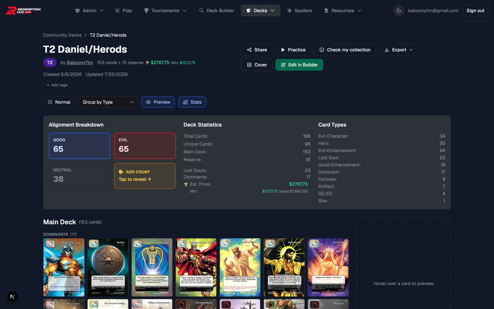
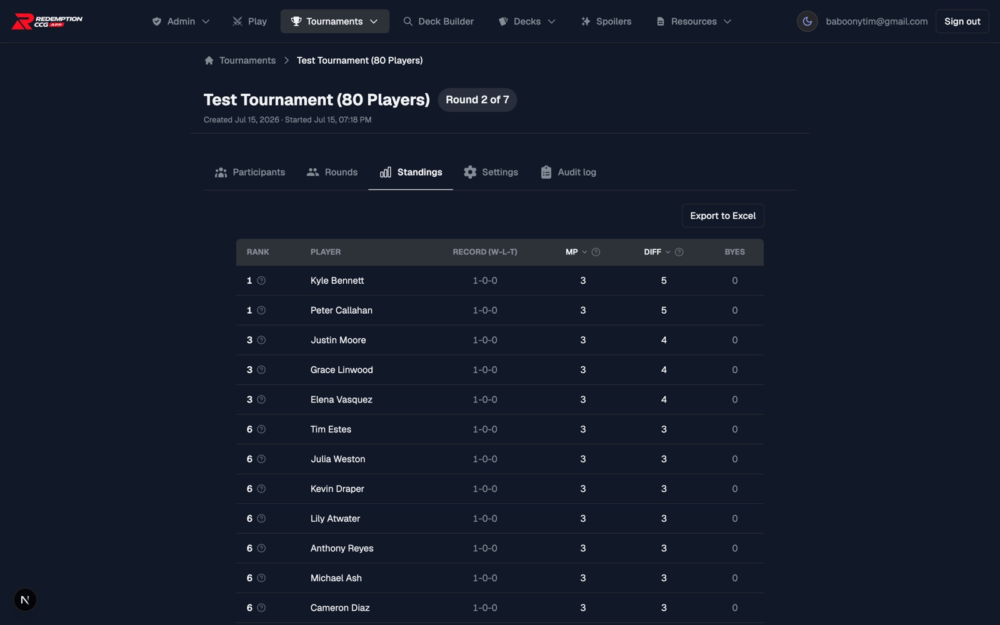
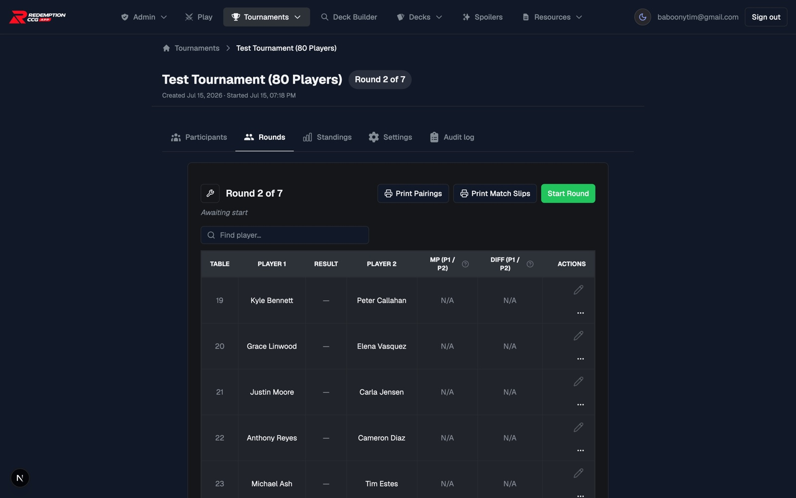
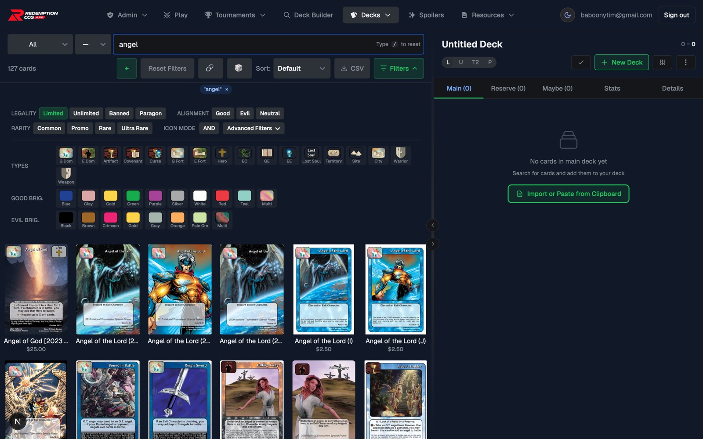
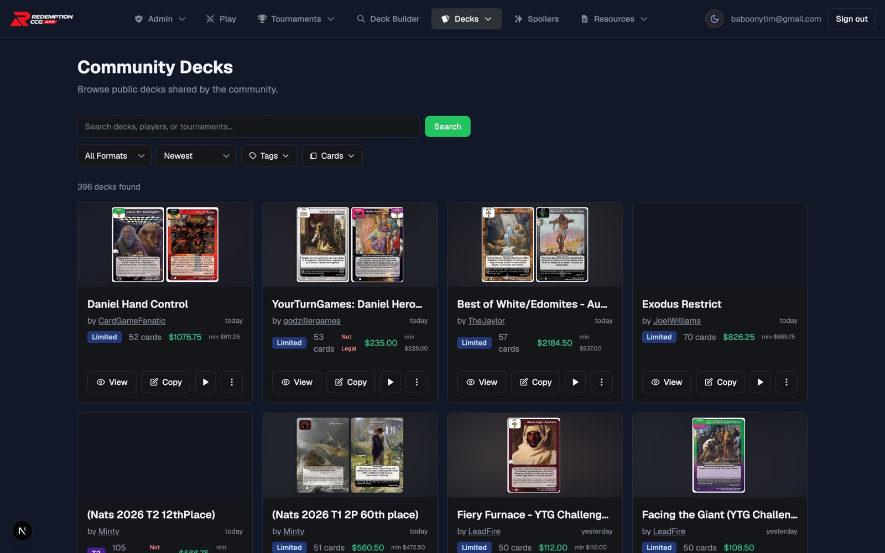
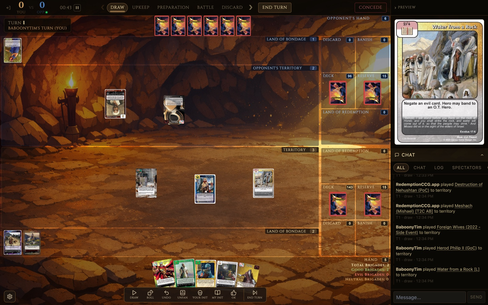
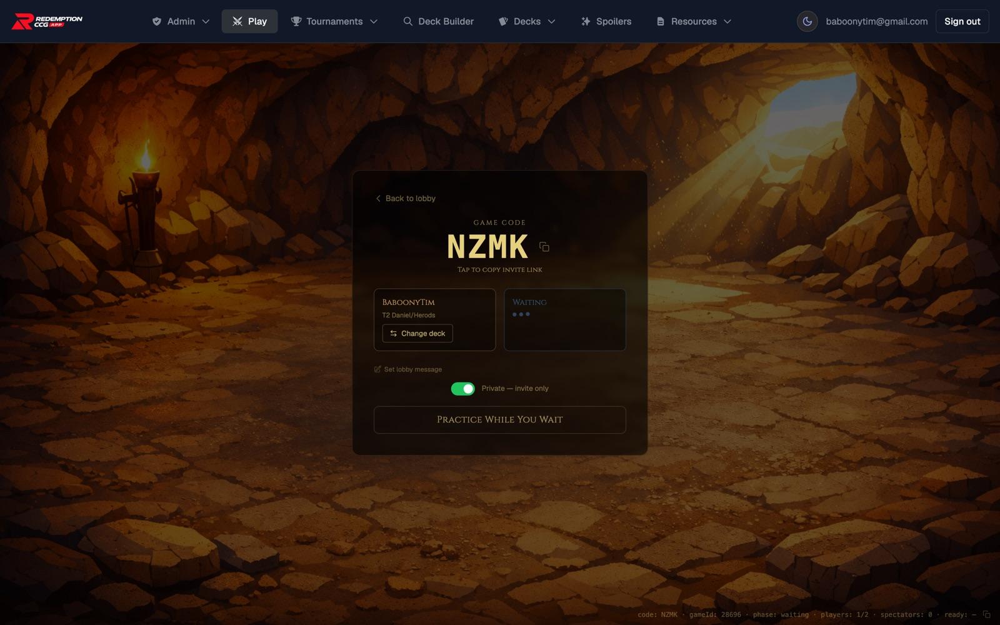
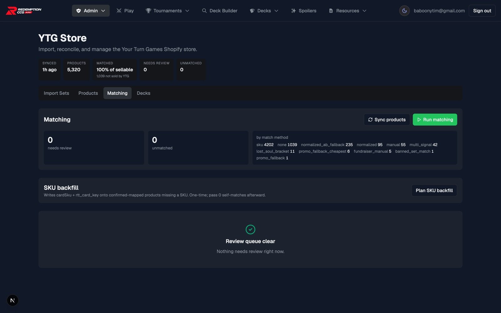
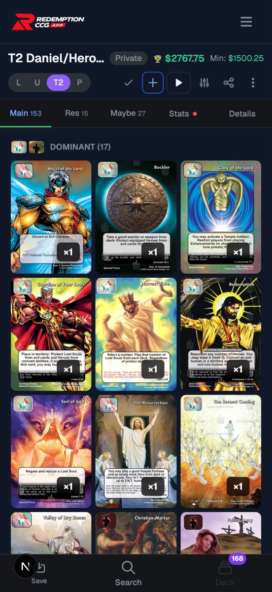
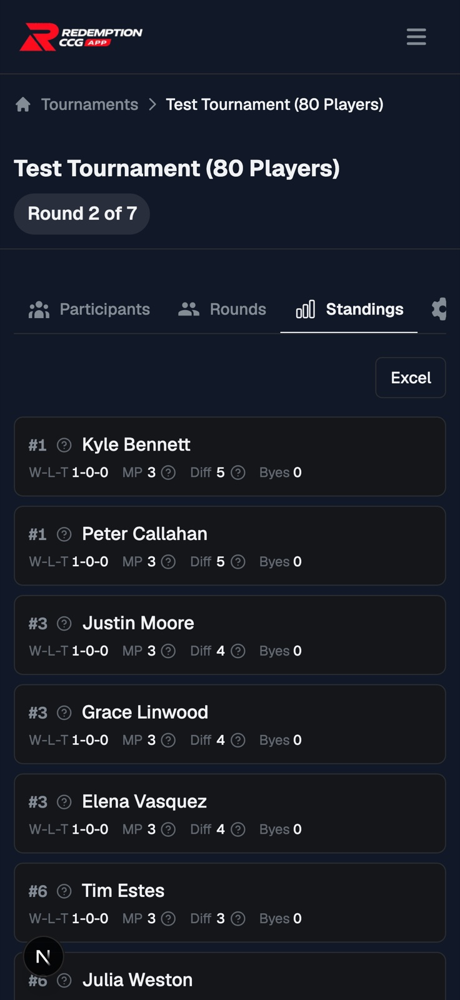

<div align="center">

# Redemption CCG App

**The tournament software, deck builder, and online play client for the Redemption trading card game.**

[](https://redemptionccg.app)
[](https://nextjs.org)
[](https://react.dev)
[](https://www.typescriptlang.org)
[](https://supabase.com)
[](https://spacetimedb.com)

[**redemptionccg.app**](https://redemptionccg.app)

</div>

---

## What this is

Redemption is a collectible card game that has been played competitively since 1995. Until recently
its tournaments ran on paper: hand-written pairing sheets, spreadsheets passed between judges, and
standings recalculated by hand between rounds. Deck legality was checked manually against a 100-page
rulebook, and there was no way to build or share a decklist online.

This app replaced all of that. It is now the software the community actually uses to run its events —
from weekly locals to regional qualifiers and the national championship — and the place players go to
build decks, look up rulings, and practice between tournaments.

It is a single full-stack application covering the entire competitive lifecycle: **build a deck →
validate it against official rules → register for an event → get paired → report scores → publish
standings → play online against a real opponent.**

<div align="center">
  
</div>

---

## By the numbers

Production figures, August 2026:

| | |
|---|---|
| **Registered players** | 363 |
| **Monthly active users** | ~160 |
| **Tournaments run** | 257, by 31 different hosts |
| **Matches scored** | 3,300 across 731 rounds |
| **Decks built** | 1,976 (128,831 card entries) |
| **Cards indexed** | 5,691 across 48 sets |
| **Running since** | March 2025 |

For a game whose competitive scene numbers in the hundreds, this is a substantial share of the active
player base — and effectively all of its organized play.

---

## Features

### Swiss tournament engine

The core of the app. Hosts create an event, add players, and the pairing engine handles the rest:
Swiss pairings that avoid rematches, bye selection, forfeits, drop-outs, and the official tiebreaker
chain. Standings recompute live as scores come in, and every placement can explain itself — tap the
`?` next to a rank to see exactly which tiebreaker separated two players.

Scoring follows the official Host Guide: 3 / 2 / 1.5 / 1 / 0 game score per round, with cumulative
lost-soul differential as the secondary tiebreaker and head-to-head resolution in between. The full
specification lives in [`prompt_context/algorithm.md`](prompt_context/algorithm.md).

<div align="center">
  
</div>

Pairings are generated per round with printable pairing sheets and match slips for the table — the
paper artifacts judges still need, produced from live data instead of by hand.

<div align="center">
  
</div>

### Deck builder and card search

All 5,691 printed cards, searchable by name, type, brigade, alignment, rarity, and legality, with
combinable icon filters. Decks validate live against the official Deck Building Rules across every
supported format — Limited, Unlimited, Type 2, and Paragon — so a deck that passes here passes deck
check.

<div align="center">
  
</div>

Decks can be published, copied, and browsed. Nationals and regional decklists are published here after
events, which makes this the only searchable archive of competitive Redemption decks that exists.

<div align="center">
  
</div>

### Online multiplayer

A full real-time game client — not a deck simulator bolted on, but live head-to-head play. Create a
game, send the four-letter code or invite link, and your opponent's every move appears on your board
as it happens: their hand count, their territory, cards entering battle. The screenshot below is a
live game between two accounts — the action log on the right is recording both players' plays in
real time.

<div align="center">
  
</div>

Game state lives in SpacetimeDB, an authoritative real-time database — every move is a server-side
reducer, so a laggy or malicious client can never desync the board. The client renders the full
Redemption play field (territory, Land of Redemption, Land of Bondage, reserve, deck, discard,
battle zone) on a React-Konva canvas, with turn phases, initiative prompts, dice rolls, undo, and
in-game chat. Games can be public (listed in the open lobby) or private invite-only; spectators can
watch any game by code, with opt-in hand sharing for streaming. A solo "goldfish" mode runs the same
engine without an opponent for practice, and right-click card abilities automate common effects —
token spawns, shuffle-and-draw, counters — straight from the card.

<div align="center">
  
</div>

### Retail integration (YTG Store)

The community's card retailer, Your Turn Games, runs on Shopify — and this app doubles as its
operations console. An admin area syncs the full 5,320-product catalog and matches every sellable
product to its exact card printing through a multi-strategy pipeline (SKU, normalized names,
promo and Lost-Soul-bracket fallbacks, manual overrides), with a review queue for anything
ambiguous — currently **100% of sellable products matched**. New sets are imported to the store
from card data; recorded deck sales decrement per-card inventory crash-safely.

Players see the other side of it: every deck prices itself against live store stock, a min-price
mode finds the cheapest legal printing of each card, and one click sends an entire decklist to the
store cart.

<div align="center">
  
</div>

### Mobile

Players live on their phones at tournaments — checking pairings between rounds, editing a deck in
line for deck check — so every surface is built mobile-first. Tables collapse to cards, the deck
builder becomes a thumb-driven three-tab editor with a persistent deck count, and nothing requires
a horizontal scroll.

<div align="center">
  
  &nbsp;
  
</div>

### And more

- **Card rulings** — official rulings synced from the community Discord (13,783 messages ingested),
  triaged through an admin review queue, and surfaced inline on the cards they apply to.
- **Deck checks** — generates the official deck check sheets judges fill out at competitive events.
- **The Forge** — a private card design and playtesting workspace for set designers, with card
  versioning, review proposals, and RLS-enforced secrecy between design teams.
- **Registration & QR join** — event registration, and joining a tournament by scanning a code.
- **Excel export** — standings export into the community's existing macro-enabled tracker workbook.

---

## Architecture

```
Next.js 15 App Router (React 19, TypeScript)
├── Supabase              Postgres + Auth + Row Level Security on every table
├── SpacetimeDB           authoritative real-time game state for online multiplayer
├── React-Konva           canvas rendering for the game board
├── Shopify Admin API     YTG store sync, price matching, inventory
├── Vercel Blob           card art storage
├── Upstash Redis         rate limiting
├── Resend                transactional email
└── Vercel                hosting
```

Server components and server actions talk to Postgres through `utils/supabase/server.ts`; client
components use `utils/supabase/client.ts`. Authorization is enforced in the database rather than the
application — every table has RLS, admin access runs through a Postgres role, and there are
regression tests that assert an anonymous client cannot read private Forge or superuser data.

Card data is generated into a typed module at build time from the community's canonical card file, so
card lookups are a synchronous in-memory index rather than a query.

### Engineering worth calling out

- **The pairing engine is spec-driven.** Official tournament rules were written up as an executable
  specification first (`prompt_context/algorithm.md`), including the cases the official guide leaves
  silent, then implemented against it. Head-to-head tiebreaks use "beat-all" semantics and re-run
  after every removal from the tied group, which is the subtle part most implementations get wrong.
- **One ranking function, three surfaces.** The standings tab, the printed sheet, and the published
  public results page all call the same `orderByTiebreakers`, so they cannot disagree.
- **Real-time state is authoritative server-side.** Game moves are reducers on SpacetimeDB, not client
  writes — a disconnected or malicious client cannot desync the board.
- **94 migrations, all forward.** Schema changes ship as numbered SQL migrations under
  `supabase/migrations/`.

---

## Getting started

**Prerequisites:** Node.js 22+, a Supabase project.

```bash
git clone https://github.com/timothestes/redemption-tournament-tracker
cd redemption-tournament-tracker
npm install
cp .env.example .env.local   # fill in Supabase URL + keys
npm run dev                  # http://localhost:3000
```

| Command | |
|---|---|
| `npm run dev` | Development server |
| `npm run build` | Production build |
| `npm test` | Unit tests (Vitest) |
| `npm run test:e2e` | End-to-end tests (Playwright) |
| `make update-cards` | Pull the latest card data and regenerate TypeScript |
| `make update-paragons` | Pull the latest Paragon data and regenerate TypeScript |

Database migrations live in `supabase/migrations/` and apply in numeric order.

---

## Repository layout

```
app/                    Routes, server actions, and page-level components
  decklist/             Deck builder, card search, community decks
  tracker/              Tournament host interface
  play/  goldfish/      Online and solo play
  forge/                Private card design workspace
  admin/                Admin tooling
components/             Shared UI (shadcn/ui + Tailwind)
lib/                    Domain logic — cards, tournaments, standings, pricing
utils/tournament/       Pairing algorithm
spacetimedb/            Real-time game module and schema
supabase/migrations/    Schema history
prompt_context/         Specifications: pairing algorithm, deck rules, design system
docs/                   Design docs, specs, and the roadmap
```

Key references are indexed in [`CLAUDE.md`](CLAUDE.md); the backlog lives in
[`docs/roadmap.md`](docs/roadmap.md).

---

## License

MIT — see [LICENSE](LICENSE).

Redemption is a trademark of Cactus Game Design. This is an independent community project; card
images and card data are the property of their respective owners.
